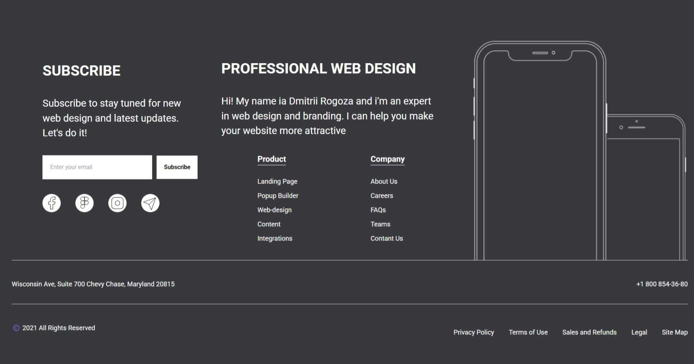

## ESP:

# Proyecto 13 - Footer Phone (Responsive)

Maquetación de un ejemplar de footer para una pagina de venta de moviles en HTML, CSS, Astro y Tailwind

## 🎯 Objetivo del Proyecto

El objetivo de este proyecto es aplicar todo lo aprendido en HTML, CSS, Astro y Tailwind

## 👁️ Vista previa del proyecto



## 🛠️ Estructura del Proyecto

El proyecto está organizado por componentes. Cada componente es utilizado en el index.astro


## 🚀 Funcionalidades y uso

Podrás usar la página pinchando en el siguiente enlace gracias a Github Pages:

https://kaeedev.github.io/Proyecto-14-Footer-Phone/

## 🛠️ Instalación y Ejecución

1. Clona este repositorio:
   ```bash
   https://github.com/kaeedev/Proyecto-14-Footer-Phone.git

2. No requiere de instalación. Con la extensión live server o similares de VSCODE podrás ver el proyecto de manera local

## 📝 Licencia

Este proyecto está disponible únicamente para uso **docente** y con fines de aprendizaje.

### Condiciones:
- El código fuente de este proyecto puede ser usado, modificado y distribuido solo con fines educativos.

Si tienes alguna duda o quieres utilizar algún recurso de este proyecto, por favor contacta conmigo.
